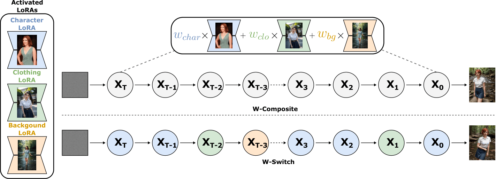
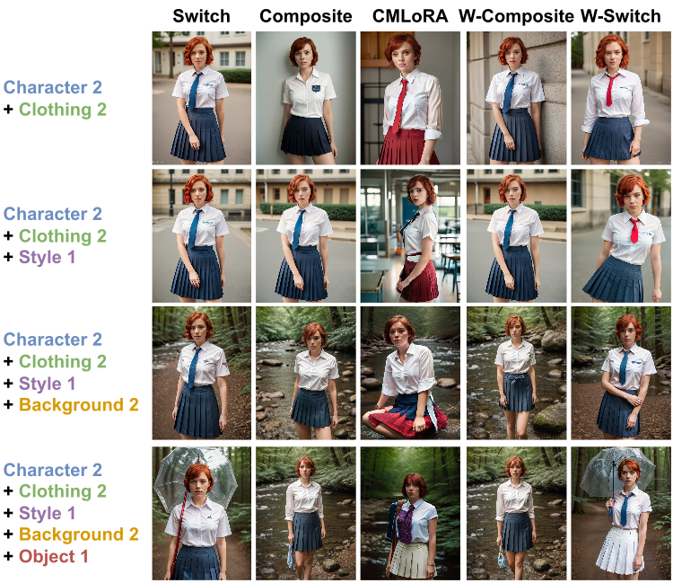

# Training-Free Multi-Concept LoRA Composition with Prompt-Aware Weighting [IEEE FG 2026]

[](https://arxiv.org/abs/2606.03792)
[](https://ieeexplore.ieee.org/document/11557018)

Official PyTorch implementation of **[Training-Free Multi-Concept LoRA Composition with Prompt-Aware Weighting](https://arxiv.org/abs/2606.03792)**. If you use this code for your research, please cite our paper.



> **Training-Free Multi-Concept LoRA Composition with Prompt-Aware Weighting** <br>
> Georgios Tsoumplekas, Stella Bounareli, Vasileios Argyriou <br>
> IEEE International Conference on Automatic Face and Gesture Recognition (FG), 2026 <br>
>
>  **Abstract**: Low-Rank Adaptation (LoRA) successfully enables personalization in text-to-image generation by adapting pre-trained diffusion models to specific visual concepts and styles. However, extending such models to multi-concept customization remains challenging. Naively combining multiple LoRA weights or their outputs often leads to interference among concepts, resulting in degraded visual quality and reduced fidelity to the reference images of individual concepts. This paper proposes a simple yet effective approach for multi-concept customization by optimally combining the outputs of multiple LoRA modules. We leverage the relative importance of each concept during generation, as inferred from its corresponding prompt tokens and introduce two methods, W-Switch and W-Composite, that employ a prompt-aware importance weighting strategy in which each LoRA is weighted according to the semantic influence of its trigger words in the target prompt. In addition, we extend existing quantitative evaluation metrics by proposing a new image-based similarity evaluation framework that assesses image fidelity and identity preservation through comparisons between real-world reference images and automatically segmented concept regions from generated images. We evaluate our approach on the ComposLoRA testbed and demonstrate consistent improvements over existing state-of-the-art methods in terms of visual quality, identity preservation and compositionality. Qualitative evaluations, including a Large Language Model (LLM) based assessment and a user study, further validate the effectiveness of the proposed methods and align with the newly introduced quantitative image-based metrics.



## 🛠️ Installation

From the repository root:

```bash
conda create -n prompt-aware-lora python=3.10.19 -y
conda activate prompt-aware-lora
pip install torch==2.8.0 torchvision==0.23.0 --index-url https://download.pytorch.org/whl/cu126
pip install -r requirements.txt
```

## 📦 Models

Download the weights below and place them in `models/` as follows:

```text
models/
├── pretrained_models/
│   ├── s3fd-619a316812.pth
│   └── model_ir_se50.pth
└── lora/
    └── reality/
        ├── character_1.safetensors
        ├── character_2.safetensors
        ├── character_3.safetensors
        ├── clothing_1.safetensors
        ├── clothing_2.safetensors
        ├── style_1.safetensors
        ├── style_2.safetensors
        ├── background_1.safetensors
        ├── background_2.safetensors
        ├── object_1.safetensors
        └── object_2.safetensors
```

| Model | Download |
| --- | --- |
| S3FD | [s3fd-619a316812.pth](https://www.adrianbulat.com/downloads/python-fan/s3fd-619a316812.pth) |
| ArcFace IR-SE50 | [model_ir_se50.pth](https://drive.google.com/drive/folders/1QR03fCPn9RpZqHkeiGWgbtocKGtLqZim?usp=sharing) |
| character_1 | [IU](https://civitai.com/models/11722/iu?modelVersionId=18576) |
| character_2 | [Scarlett Johansson](https://civitai.com/models/7468/scarlett-johanssonlora) |
| character_3 | [Dwayne Johnson](https://civitai.com/models/22345/dwayne-the-rock-johnsonlora?modelVersionId=26680) |
| clothing_1 | [Thai university uniform](https://civitai.com/models/12657/thai-university-uniform?modelVersionId=58690) |
| clothing_2 | [School dress](https://civitai.com/models/201305?modelVersionId=291486) |
| style_1 | [Japanese film color](https://civitai.com/models/90393/japan-vibes-film-color?modelVersionId=107032) |
| style_2 | [Brightness tweaker](https://civitai.com/models/70034/brightness-tweaker-lora-lora) |
| background_1 | [Library bookshelf](https://civitai.com/models/113488/library-bookshelf?modelVersionId=125699) |
| background_2 | [Forest](https://civitai.com/models/104292/the-forest-light?modelVersionId=127699) |
| object_1 | [Umbrella](https://civitai.com/models/54218/umbrellalora?modelVersionId=58578) |
| object_2 | [Bubble gum](https://civitai.com/models/97550/bubble-gum-kaugummi-v20?modelVersionId=117038) |

The LoRA files used in the paper are also packed together in [ComposLoRA.zip](https://drive.google.com/file/d/1SuwRgV1LtEud8dfjftnw-zxBMgzSCwIT/view?usp=sharing), under `lora/reality/`.

## 🖼️ Reference images

Reference photos can be found at:

**[Google Drive — reference images](https://drive.google.com/drive/folders/1QR03fCPn9RpZqHkeiGWgbtocKGtLqZim?usp=sharing)**

Unzip them so the repository contains:

```text
.
├── concept_images/
│   ├── character_1/
│   ├── character_2/
│   ├── character_3/
│   ├── clothing_1/
│   ├── clothing_2/
│   ├── background_1/
│   ├── background_2/
│   ├── object_1/
│   ├── object_2/
│   ├── style_1/
│   └── style_2/
└── concept_images_cropped/
    ├── character_1_cropped/
    ├── character_2_cropped/
    ├── character_3_cropped/
    ├── clothing_1_cropped/
    ├── clothing_2_cropped/
    ├── background_1_cropped/
    ├── background_2_cropped/
    ├── object_1_cropped/
    └── object_2_cropped/
```

## 🚀 Inference

```bash
python example.py --method w-switch
python example.py --method w-composite
```

The default composition is `character_2` and `clothing_2` at seed 11. The generated image is 1024x768 and written to `outputs/examples/`.

```bash
python example.py --method w-switch --loras character_3 clothing_2 --seed 42 \
  --save_path outputs/examples/custom.png
```

## 📊 Reproducing the results

### 1. 🎨 Generate images

```bash
bash scripts/generate_benchmark.sh
```

### 2. ✂️ Crop concepts

**Faces** are cropped in this repository with the S3FD detector and FAN landmarks:

```bash
bash scripts/crop_faces.sh
```

**Every other concept** is cropped with SAM3 in a separate repository. Copy these crops into the same folders, one directory per LoRA ID:

```text
outputs/cropped/weighted_switch_adaptive_tailed_ablated_2_cropped/
├── character_1/
├── character_2/
├── character_3/
├── clothing_1/
├── clothing_2/
├── background_1/
├── background_2/
├── object_1/
├── object_2/
├── style_1/
└── style_2/
```

Repeat that layout for N = 3, 4, and 5, and for `weighted_composite_adaptive_triggered_*_cropped`.

### 3. 📐 Image, identity, and text alignment

```bash
bash scripts/evaluate_table1.sh
```

### 4. 🤖 LLM-based quality assessment

```bash
bash scripts/evaluate_table2.sh
```

## 📝 Citation

```bibtex
@inproceedings{tsoumplekas2026promptaware,
  title     = {Training-Free Multi-Concept LoRA Composition with Prompt-Aware Weighting},
  author    = {Tsoumplekas, Georgios and Bounareli, Stella and Argyriou, Vasileios},
  booktitle = {IEEE International Conference on Automatic Face and Gesture Recognition (FG)},
  year      = {2026},
  url       = {https://ieeexplore.ieee.org/document/11557018}
}
```

## 🙏 Acknowledgements

We thank [Zhong et al.](https://github.com/maszhongming/Multi-LoRA-Composition) for the ComposLoRA testbed, [Bulat and Tzimiropoulos](https://github.com/1adrianb/face-alignment) for the S3FD detector and FAN landmarks used to crop faces, [Deng et al.](https://github.com/deepinsight/insightface) for the IR-SE50 ArcFace backbone used for identity alignment, [Radford et al.](https://github.com/openai/clip) for CLIP and [Oquab et al.](https://github.com/facebookresearch/dinov2) for DINOv2 used for image and text alignment and [Yao et al.](https://github.com/OpenBMB/MiniCPM-V) for [MiniCPM-V 2.6](https://huggingface.co/openbmb/MiniCPM-V-2_6) used for the qualitative scores.
